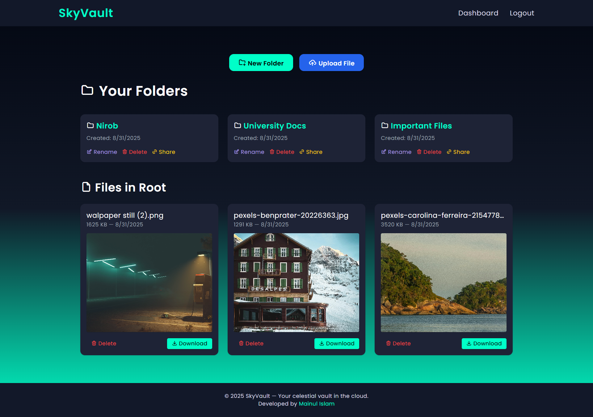
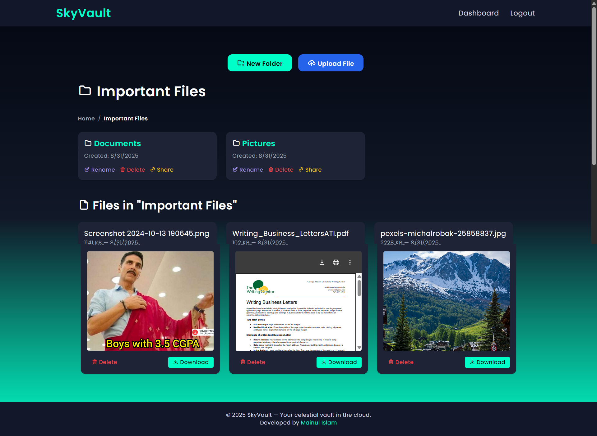
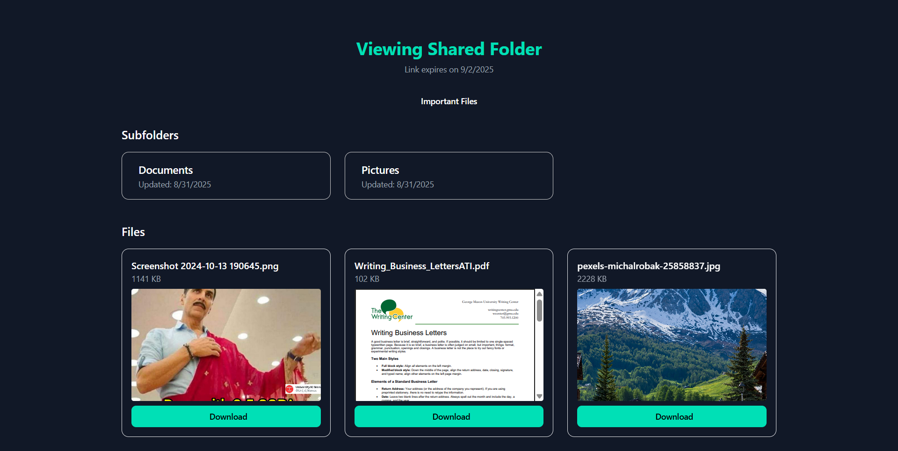

# 📁 File Uploader App [🔗 Live Demo](https://skyvault-jjha.onrender.com/)

A sleek and scalable file uploader built with **Node.js**, **Express**, **EJS**, and **Cloudinary**. Users can upload files into folders, preview them instantly, and manage their content with a clean, responsive interface.

## 📸 Screenshots

### 🖼️ Homepage

### 🗂️ Dashboard

### 📤 Nested Folder

### 🔗 Shared Folder Preview

---

## 🚀 Features

- 📤 Upload files to root or specific folders
- 🗂️ Create folders and organize files hierarchically
- 🖼️ Preview images, PDFs, and videos in-app
- 🔗 Share folders publicly with optional expiry
- 🧹 Delete folders and files with cascading logic
- 📱 Responsive layout with sticky header/footer
- 🎨 Elegant UI powered by Tailwind CSS

---

## 🔮 To Do for Future Improvements

* ⚡ Flash messages for every user action (upload, delete, rename)
* 🧩 Drag-and-drop file organization
* 📂 Move and copy files between folders
* 🔄 Rename files with inline editing
* 📦 Bulk actions (multi-select, batch delete)
* 🔐 Role-based access for shared folders
* 📊 Dashboard analytics (file count, usage stats)

---

## 🌐 Tech Stack

| Layer        | Technology            |
| ------------ | --------------------- |
| Backend      | Node.js, Express.js   |
| Templating   | EJS                   |
| ORM          | Prisma                |
| Database     | PostgreSQL (via Neon) |
| File Hosting | Cloudinary            |
| Deployment   | Render                |
| Styling      | Tailwind CSS          |

---

👤 Author : **Mainul Islam**

* 💼 [LinkedIn](https://www.linkedin.com/in/mainul-islam-nirob/)
* 🐦 [Twitter](https://twitter.com/Mainuli96601040)
* 📘 [Facebook](https://web.facebook.com/mmmuinul.islam/)
* 💻 [GitHub](https://github.com/Mainul-Islam-Nirob)
